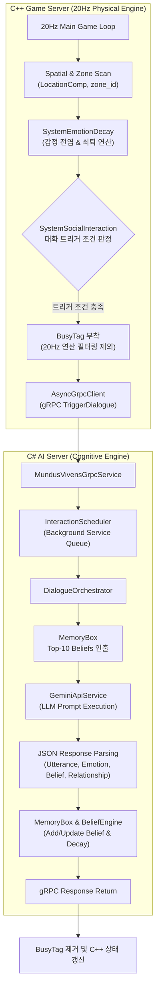
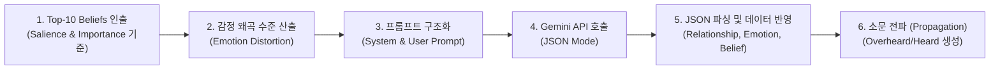

# 🧠 Mundus Vivens: Agent Execution Architecture & Memory Systems

이 문서는 `Mundus Vivens` 게임 서버(C++) 및 AI 서버(C#) 환경에서 에이전트(NPC)의 물리적 연산, 감정 전염, 대화 트리거, 기억(Belief) 관리, 그리고 일일 스케줄링이 작동하는 **실제 구현 레벨의 상세 아키텍처 명세(Technical Spec)**입니다.

---

## 1. 분산 아키텍처 및 역할 분담 구조

본 프로젝트는 물리/공간 연산을 구동하는 **C++ 게임 서버**와 인지/대화/LLM 연산을 구동하는 **C# AI 서버**가 gRPC 프로토콜을 통해 비동기로 통신하는 2-서버 구조로 작동합니다.



---

## 2. C++ 게임 서버: 물리 및 감정 연산 시스템 (`Systems.cpp`)

C++ 서버는 EnTT ECS(Entity Component System) 기법을 사용하여 에이전트의 상태를 관리합니다.

### A. 감정 쇠퇴 및 구역(Zone) 감정 전염 (`SystemEmotionDecay`)
1.  **구역 스캔**: 매 틱마다 `LocationComp`와 `EmotionComp`를 가진 모든 엔티티를 스캔하여, 각 `zone_id`에 존재하는 부정적 감정("분노", "적대", "공포") 목록을 수집합니다.
2.  **연산 배제 (`entt::exclude<BusyTag>`)**: LLM 연산 대기 중이거나 대화 중인 엔티티(`BusyTag` 소유)는 감정 쇠퇴 및 전염 연산 대상에서 즉시 제외됩니다.
3.  **감정 쇠퇴**: `decay_ticks_remaining` 카운터가 감소하여 0에 도달하면 `current_emotion`이 `base_emotion`으로 자동 복귀합니다.
4.  **감정 전염 (Contagion)**:
    *   동일 구역에 부정적 감정을 가진 NPC가 존재할 때, 주변의 평온한 NPC가 감염될 확률은 다음과 같이 계산됩니다:
        $$\text{InfectChance} = \min(0.45, \text{Count}(\text{NegativeEmotions}) \times 0.15)$$
    *   확률 통과 시 대리 감정("불안" 또는 "경계")으로 상태가 전이되며 5틱 동안 지속됩니다.

### B. 대화 트리거 및 하드 판정 (`SystemSocialInteraction`)
1.  **활동 집중도 판정 (`IsNPCFocusedOnActivity`)**:
    *   "취침", "휴식" 활동 중 ➔ 대화 트리거 차단.
    *   "기도", "명상" 활동 중 ➔ 80% 확률로 대화 트리거 차단.
2.  **기본 확률 및 변조**:
    *   8% 기본 확률에 감정 상태 및 NPC 간 관계성 수치를 더해 최종 확률을 산출합니다.
3.  **`BusyTag` 부착 및 비동기 발송**:
    *   대화가 성사되면 해당 엔티티에 `BusyTag`를 컴포넌트로 부착하고, C# 서버로 gRPC `TriggerDialogue` 메시지를 발송합니다.

---

## 3. C# AI 서버: 기억(Belief) 및 인지 모델 (`Models/`)

### A. 통합 믿음 모델 (`Belief.cs`)
에이전트의 모든 기억과 사실 정보는 단일 `Belief` 클래스로 포맷팅되어 관리됩니다.

```csharp
public class Belief
{
    public string BeliefId { get; set; }
    public string SubjectId { get; set; }
    public string Content { get; set; }
    public BeliefType Type { get; set; } // Core, Witnessed, Heard, Overheard
    
    public double Confidence { get; set; }      // 확신도 (0.0 ~ 1.0)
    public double Salience { get; set; }        // 현저성 (0.0 ~ 1.0)
    public double EmotionalCharge { get; set; } // 정서적 강도 (0.0 ~ 1.0)
    
    public string SourceAgentId { get; set; }
    public List<string> PropagationPath { get; set; }
    public HashSet<string> SharedWith { get; set; }
    public DateTime AcquiredAt { get; set; }
    public float[]? ContentEmbedding { get; set; }
}
```

### B. 믿음 중요도(Importance) 수식 및 예산 도태 (Eviction)
기억 저장소(`MemoryBox`)는 예산 제한 한도(`MaxTotalBeliefs = 40`, `MaxCoreBeliefs = 5`)를 가집니다.

1.  **중요도(Importance) 계산 공식**:
    $$\text{Importance} = (\text{Confidence} \times 0.4) + (\text{Salience} \times 0.35) + (\text{EmotionalCharge} \times 0.25)$$
2.  **Core 예산 초과 시 강등 (Demotion)**:
    *   `Core` 타입 믿음이 5개를 초과하면, `Importance`가 가장 낮은 `Core` 믿음이 `Witnessed` 타입으로 강등되고 `AcquiredAt` 타임스탬프가 재조정됩니다.
3.  **전체 예산 초과 시 도태 (Eviction)**:
    *   전체 믿음 수가 40개를 초과하면, `Type != Core`인 일반 믿음 중 `Importance` 점수가 가장 낮은 객체가 `MemoryBox.Beliefs` 딕셔너리에서 영구 삭제됩니다.

### C. 틱 기반 현저성 감쇠 (Salience Decay)
매 동기화 틱마다 `BeliefEngine.cs`에 의해 타입별로 `Salience`가 차등 감소합니다.

| Belief Type | 틱당 감소량 (Decay Rate) | 특징 |
| :--- | :--- | :--- |
| **Core** | `-0.001` / tick | 정체성 및 핵심 신념 (Eviction 면역) |
| **Witnessed** | `-0.002` / tick | 직접 눈으로 목격한 사실 |
| **Heard** | `-0.005` / tick | 타인에게 전달받은 정보 |
| **Overheard** | `-0.010` / tick | 엿들음 (가장 빠르게 감쇠) |

*   **발설 감속 룰**: 에이전트가 해당 믿음을 타인에게 발설하여 `SharedWith` 셋에 상대방 ID가 추가되면, 감소율이 50%(`* 0.5`)로 감소하여 뇌 속에 오래 유지됩니다.

---

## 4. 대화 오케스트레이션 및 LLM 파이프라인 (`DialogueOrchestrator.cs`)

`SystemSocialInteraction`에 의해 대화가 요청되면 `DialogueOrchestrator`가 다음 순서로 대화를 처리합니다.



1.  **기억 인출**: 에이전트의 `MemoryBox`에서 현재 활성도(`Salience`)와 중요도(`Importance`)가 높은 상위 10개 믿음을 추출합니다.
2.  **감정 왜곡 적용**: 현재 `EmotionComp` 상태에 따라 대사 톤 및 표현에 가중치 매개변수를 주입합니다.
3.  **LLM 프롬프트 발송**: Gemini API(JSON 모드)로 대사 생성 요청을 전달합니다.
4.  **결과 반영**:
    *   NPC 대사 리턴.
    *   관계성 수치(`Relationship.cs`) 갱신.
    *   대화 결과로 얻은 정보는 새로운 `Belief`로 추가되고, 대화 상대방 ID가 `SharedWith` 목록에 기록됩니다.

---

## 5. 일일 성찰 및 스케줄링 시스템 (`DailyPlanService.cs`)

에이전트는 하루 24시간을 0시부터 23시까지의 시간 단위 틱(Tick)으로 분할하여 생활합니다.

### A. 23:00 틱 성찰 및 스케줄 생성 프로세스
1.  **트리거**: 월드 시계가 23:00 틱에 진입하면 `ProcessWorldTickAsync`가 가동됩니다.
2.  **데이터 수집**: `MemoryBox`에서 오늘 진행된 `ActiveConversation` 대화록과 신규 변동된 `Belief` 목록을 수집합니다.
3.  **성찰(Reflection) 프롬프트 실행 (`ReflectOnEpisodesAsync`)**:
    *   LLM에게 오늘 하루 동안 발생한 에피소드(`Witnessed` 믿음 리스트)를 수집하여 전달하고, 깊이 깨달은 장기 기억(`core_facts`)을 도출하도록 프롬프트를 실행합니다.
    *   도출된 성찰 기억은 현저성(`Salience = 1.0`), 중요도 기반 신뢰도(`Confidence`)를 가진 `BeliefType.Witnessed` 타입의 신규 `Belief` 객체로 등록되어 `MemoryBox`에 추가됩니다. (현재 코드 기준 `BeliefType.Core`로 승격하지 않고 감쇠 대상인 `Witnessed`로 저장됨)
4.  **다음 날 스케줄 생성**:
    *   00:00 ~ 23:00까지 24시간 분량의 1시간 단위 스케줄(목표 장소 `TargetLocation`, 활동 내용 `Activity`)을 JSON 배열로 생성합니다.
5.  **좌표 변환**: `LocationCoordinateRegistry`를 조회하여 장소 텍스트(예: "도서관", "광장")를 C++ 물리 엔진이 이해할 수 있는 이동 좌표(Waypoint)로 변환해 C++ 서버로 전달합니다.
