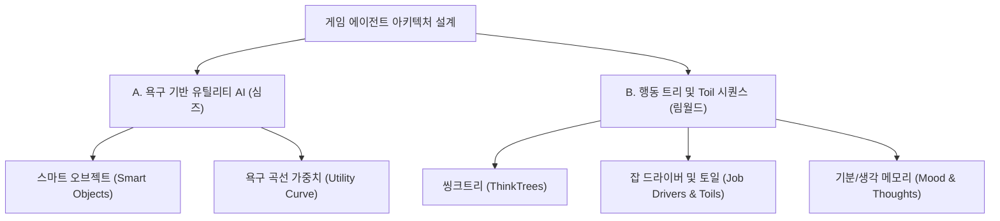

# 심즈(The Sims) & 림월드(RimWorld) AI 아키텍처 상세 분석 보고서

이 보고서는 전통적 시뮬레이션 인공지능의 양대 산맥인 Maxis의 *심즈(The Sims)*와 Ludeon Studios의 *림월드(RimWorld)*의 AI 아키텍처 설계와 작동 방식을 코드 레벨에서 분석한 백서입니다. 본 아키텍처 가이드는 `Mundus Vivens` 에이전트 설계 고도화 시 직접적으로 참고하기 위해 작성되었습니다.

---

## 1. 개요: 에이전트 시뮬레이션의 두 가지 패러다임

가상 월드에서 NPC들의 자율 사회를 시뮬레이션할 때, 에이전트의 의사결정과 실제 행동 제어를 처리하는 전통적인 근본 아키텍처는 크게 두 갈래로 나뉩니다.



1.  **스마트 오브젝트 기반 유틸리티 AI (*심즈*)**: 뇌가 아닌 월드의 오브젝트들이 행동 지식을 가지고 광고(Affordance)하며, 에이전트가 자신의 실시간 욕구 점수를 기반으로 무엇을 할지 선택합니다. 에이전트가 가볍고 확장성이 뛰어납니다.
2.  **행동 트리 및 행동 조각(Toil) 순차 실행 (*림월드*)**: 에이전트가 상태 트리(ThinkTree)를 타고 올라가며 우선순위(Emergency ➔ Work)를 결정하고, 선택된 Job을 물리적인 아주 작은 단위의 행동 조각(Toils) 시퀀스로 쪼개어 단계별로 실행합니다. 정밀한 물리 제어 및 감정 전이에 특화되어 있습니다.

---

## 2. 심즈 (The Sims) AI 아키텍처: 스마트 오브젝트 & 유틸리티 AI

심즈는 **욕구 기반 유틸리티 AI(Needs-Based Utility AI)**와 **스마트 오브젝트(Smart Object/Affordance)**를 결합하여 에이전트의 자율성을 극한으로 끌어올렸습니다.

### A. 욕구 기반 의사결정 (Motive & Utility Curve)
*   **Motive**: 심들은 배고픔, 피로, 위생, 사교, 재미 등 6~8가지 핵심 욕구 수치(-100 ~ +100)를 가집니다.
*   **유틸리티 곡선 (Utility Curves)**: 욕구 수준에 따라 수학적 가중치 곡선이 달라집니다.
    *   *생리적 욕구 (배고픔, 피로)*: 수치가 떨어질수록 지수 함수(Exponential) 형태로 가중치 점수가 급격하게 올라가, 다른 모든 행동을 무시하고 생존 행동을 즉시 강제하게 설계됩니다.
    *   *심리적 욕구 (재미, 사교)*: 비교적 완만한 대수 함수(Logarithmic)나 선형 곡선으로 동작하여, 생리적 욕구가 어느 정도 만족되었을 때만 발현되도록 유도합니다 (매슬로의 욕구 단계설 구현).

### B. 스마트 오브젝트와 행동 제공 (Smart Objects & Affordances)
심즈의 가장 핵심적인 혁신은 **"에이전트가 아니라 사물(Object)이 똑똑하다"**는 개념입니다.
*   **Affordance (행동 제공성)**: 침대는 가만히 있지 않고 주변 에이전트들에게 *"나를 사용하면 에너지 욕구를 틱당 +10 만족시켜 줄게"*라고 광고(Advertise)합니다. 샤워기는 *"위생 +20"*을 광고합니다.
*   **의사결정 공식**: 에이전트는 주변 스마트 오브젝트들이 보내는 광고 목록을 스캔하고, 자신의 욕구 수준과 성격을 대입해 최적의 효율을 계산합니다.
    $$\text{Utility} = \text{AdvertisedValue} \times f(\text{CurrentMotiveLevel}) \times \text{PersonalityWeight} \times \frac{1}{\text{Distance}}$$
*   **예외 룰 (Random Top Choice)**: 기계적이고 뻔한 움직임을 방지하기 위해 계산된 유틸리티 점수가 가장 높은 상위 2~3개 행동 중 하나를 무작위(Random)로 선택해 동작시킵니다.

### C. 특성(Trait)과 상황(Lot)에 따른 동적 욕구 조절
*   **특성을 이용한 변수 제어**: 예컨대 '소파 감자(Couch Potato)' 특성을 가진 심은 소파가 광고하는 편안함 점수에 가중치 멀티플라이어를 크게 부여하여 자연스럽게 소파에만 앉아 있도록 유도합니다.
*   **부지(Lot) 기반 임시 욕구 주입**: 체육관(Gym) 부지에 들어가면, 월드 매니저가 심에게 '운동 욕구'를 임시로 주입합니다. 이를 통해 심들은 체육관에 들어서자마자 트레드밀을 이용하려는 행동을 취하게 됩니다. 부지를 벗어나면 해당 욕구는 수거(Garbage Collect)됩니다.

---

## 3. 림월드 (RimWorld) AI 아키텍처: ThinkTree, JobDriver, 그리고 Mood

림월드는 **행동 트리(ThinkTree)**로 현재 할 일(Job)을 고르고, **잡 드라이버(JobDriver)**와 **토일(Toils)**을 사용하여 그것을 물리적으로 쪼개어 한 단계씩 수행하며, **생각(Thought) 시스템**으로 멘탈 붕괴와 감정 상태를 통제합니다.

### A. 씽크트리 (ThinkTrees)
모든 폰(Pawn)은 주기적으로 XML로 정의된 트리 구조의 **ThinkTree**를 탐색합니다.
*   **ThinkNode_Priority**: 구형 Behavior Tree의 Selector 노드입니다. 자식 노드들을 위에서부터 아래로 순차적으로 평가하여 최초로 유효한 `Job`을 리턴하는 노드가 당첨되면 탐색을 종료합니다. (예: 긴급 도망 ➔ 전투 ➔ 자가 치료 ➔ 수면 ➔ 식사 ➔ 작업 ➔ 여가)
*   **ThinkNode_Conditional**: 조건 검사 노드로 데코레이터 패턴과 비슷하게 `IsDrafted` (소집 상태인가?), `OnFire` (몸에 불이 붙었는가?) 등을 확인해 탐색 분기를 제어합니다.

### B. 행동 실행 파이프라인 (JobDrivers & Toils)
ThinkTree가 어떤 `Job` (예: "저장고 A의 철광석을 제련기 B로 운반하라")을 채택하면, 그 구체적인 실무는 **JobDriver** 클래스가 인계받아 실행합니다.
*   **사전 자원 예약 (TryMakePreToilReservations)**:
    *   JobDriver는 행동을 시작하기 전, 필요한 아이템이나 작업 공간 타일을 반드시 **예약(Reserve)**해야 합니다. 
    *   이를 통해 두 폰이 하나의 작업대를 동시에 쓰려고 하거나, 한 개밖에 없는 음식을 동시에 집으려다 코드 에러(Null-Pointer Exception)가 나는 레이스 컨디션을 원천 방지합니다.
*   **토일(Toils)의 결합**: `MakeNewToils()`는 `Toil`이라는 미세 단계(행동 조각)들의 리스트를 순차 리턴합니다.
    *   *예시 (제련하기)*: `[제련기로 걸어가기] ➔ [철광석 가져오기] ➔ [제련기에서 대기/조작(Tick 재생)] ➔ [결과물 생성]`
    *   **Toil의 구성**: Toil은 시작 시 1번 실행되는 `initAction`, 매 프레임 실행되는 `tickAction`, 완료 시 실행되는 `finishAction`으로 구성됩니다.
    *   **실패 예외 처리**: Toil 실행 도중 누군가 가스레인지를 파괴하거나 재료를 훔쳐 가면, `FailOnCannotTouch()`나 `FailOnDespawnedOrNull()` 훅이 걸려 있어 즉시 Job을 중단하고 C++의 크래시 없이 안전하게 다음 ThinkTree로 회귀합니다.

### C. 기분 및 생각 시스템 (Mood & Thoughts)
*   **ThoughtDef (XML)**: 생각의 데이터적 정의 및 가중치(버프/디버프)를 관리합니다 (예: `"테이블 없이 식사함: 무드 -4"`, `"친구가 죽음: 무드 -20"`).
*   **Thought_Memory (휘발성 기억)**: 사건에 의해 생성되어 시간이 지남에 따라 점차 효과가 감쇠(Decay)되고 타이머가 끝나면 소멸합니다.
*   **Thought_Situational (상황성 기억)**: 어두운 곳에 있거나 방이 지저분한 동안에만 실시간 조건 검사로 계속 유지되며, 그 장소를 벗어나면 즉시 제거됩니다.
*   **기분(Mood) ➔ 정신 붕괴**: 모든 생각들의 무드 가중치 합산이 정신 붕괴 임계치(10%~35%) 이하로 떨어지면, 폰은 고유의 **광기/정신이상 상태(Mental State)**에 돌입하여 플레이어의 제어를 무시하고 방화, 방황, 폭력 등의 난동 상태 머신으로 강제 전이됩니다.

---

## 4. 아키텍처 비교 요약

| 비교 항목 | 심즈 (The Sims) AI | 림월드 (RimWorld) AI |
| :--- | :--- | :--- |
| **코어 아키텍처** | Utility AI + 스마트 오브젝트 | ThinkTrees (BT) + JobDrivers / Toils |
| **행동 로직의 위치** | 오브젝트 내부 (오브젝트가 똑똑함) | C# 코드 및 XML 트리 (에이전트가 직접 제어) |
| **실행 방식** | 단발성 욕구 충족 연산 | Toil 시퀀스 기반의 다단계 물리 흐름 제어 |
| **동시성 제어** | 타깃 락킹 (Target Locking) | 예약 매니저를 통한 사전 타일/자원 선점 |
| **성격 표현** | 특성이 유틸리티 욕구 가중치를 보정 | 특성이 생각 가중치 및 기분 한계점을 보정 |

---

## 5. Mundus Vivens 개발자를 위한 하이브리드 아키텍처 구현 예시

`Mundus Vivens`와 같은 에이전트 시스템에 두 게임의 핵심 가치를 녹여내는 최선의 구조는 다음과 같습니다:
1.  **C# AI 서버(뇌)**: **심즈의 유틸리티 AI** 개념을 도입하여, 에이전트의 내부 욕구(Need) 변화를 LLM 프롬프트의 가이드라인 매개변수로 결합해 스케줄/목표(Job)를 똑똑하게 채택합니다.
2.  **C++ 게임 서버(육체)**: **림월드의 JobDriver와 Toil** 개념을 도입하여, C#이 지정한 대화/일정(Job)을 C++에서 미세 액션 단위로 쪼개어 실행하고, 물리 위협 감지 시 틱 단위로 안전하게 취소(Toil Interrupt)합니다.

---

### A. 유틸리티 욕구 및 스마트 오브젝트 선택 알고리즘 (C++ 예시)

에이전트 Bob이 방 안의 여러 스마트 오브젝트를 스캔하고, 자신의 욕구(배고픔, 피로) 상태에 가중치 곡선을 적용하여 동적으로 행동을 선택하는 로직 예제입니다.

```cpp
#include <iostream>
#include <vector>
#include <string>
#include <cmath>
#include <algorithm>
#include <random>

struct Affordance {
    std::string motiveName;
    float value; // 해소 수치
};

class SmartObject {
public:
    std::string name;
    std::vector<Affordance> affordances;

    SmartObject(std::string name, std::vector<Affordance> affordances)
        : name(name), affordances(affordances) {}
};

struct Need {
    std::string name;
    float value; // -100 (고갈) ~ 100 (충족)
};

class SimAgent {
public:
    std::string name;
    std::vector<Need> needs;

    SimAgent(std::string name) : name(name) {
        needs = { {"Hunger", -20.0f}, {"Energy", 40.0f} }; // 배고픔이 다소 낮은 상태
    }

    // 욕구 상태에 따른 가중치 곡선 연산 (낮을수록 기하급수적으로 높은 가중치)
    float GetNeedMultiplier(const std::string& needName) {
        auto it = std::find_if(needs.begin(), needs.end(), [&](const Need& n) { return n.name == needName; });
        if (it == needs.end()) return 1.0f;
        
        // [-100, 100] 수치를 [0, 1]로 정규화
        float normalized = (it->value + 100.0f) / 200.0f; 
        
        // 지수 함수 곡선: 욕구가 고갈될수록 절박함이 10배 이상 올라감
        return std::pow(1.0f - normalized, 2.0f) * 10.0f + 0.1f;
    }

    void EvaluateAndAct(const std::vector<SmartObject>& roomObjects) {
        struct ActionOption {
            const SmartObject* obj;
            Affordance aff;
            float utility;
        };

        std::vector<ActionOption> options;

        for (const auto& obj : roomObjects) {
            for (const auto& aff : obj.affordances) {
                float multiplier = GetNeedMultiplier(aff.motiveName);
                float utility = aff.value * multiplier;
                options.push_back({ &obj, aff, utility });
            }
        }

        // 유틸리티 점수 내림차순 정렬
        std::sort(options.begin(), options.end(), [](const ActionOption& a, const ActionOption& b) {
            return a.utility > b.utility;
        });

        if (options.empty()) return;

        // 기계적 반복을 막기 위해 상위 2개 최적 행동 중 무작위 선택
        int limit = std::min(2, (int)options.size());
        std::random_device rd;
        std::mt19937 gen(rd());
        std::uniform_int_distribution<> dis(0, limit - 1);
        int choice = dis(gen);

        const auto& selected = options[choice];
        std::cout << name << "의 최종 의사결정: " << selected.obj->name 
                  << " 사용 (대상 욕구: " << selected.aff.motiveName 
                  << ", 산출 유틸리티: " << selected.utility << ")\n";
    }
};

int main() {
    // 방 안에 배치된 스마트 오브젝트들과 각 오브젝트의 제공 속성(Affordance)
    std::vector<SmartObject> room = {
        SmartObject("냉장고", { {"Hunger", 60.0f} }),
        SmartObject("소파", { {"Energy", 15.0f}, {"Comfort", 20.0f} }),
        SmartObject("침대", { {"Energy", 80.0f} })
    };

    SimAgent agent("Bob");
    agent.EvaluateAndAct(room);
    return 0;
}
```

---

### B. 행동 트리(ThinkTree)와 다단계 Toil 제어 구조 (C# 예시)

주기적으로 상태 우선순위(Sleep vs Wander)를 계산하고, 잡을 획득하면 예약부터 세부 실행까지 Toil 단계로 쪼개어 연속 프레임으로 가동하는 로드맵 예제입니다.

```csharp
using System;
using System.Collections.Generic;

namespace GameSimulation {
    public class Pawn {
        public string Name { get; set; }
        public float Rest { get; set; } = 25.0f; // 수면이 필요한 임계치 상태
        public Job CurrentJob { get; set; }
        public JobDriver CurrentDriver { get; set; }

        public void Tick() {
            if (CurrentJob == null) {
                EvaluateThinkTree();
            }
            if (CurrentDriver != null) {
                CurrentDriver.TickDriver();
            }
        }

        private void EvaluateThinkTree() {
            var root = new ThinkNode_Priority();
            root.SubNodes.Add(new JobGiver_Sleep());
            root.SubNodes.Add(new JobGiver_IdleWander());

            ThinkResult result = root.TryIssueJobPackage(this);
            if (result.IsValid) {
                CurrentJob = result.Job;
                CurrentDriver = (JobDriver)Activator.CreateInstance(result.Job.DriverClass, this, result.Job);
                Console.WriteLine($"[{Name}] 새로운 작업 획득: {result.Job.DefName}");
            }
        }
    }

    public class Job {
        public string DefName { get; set; }
        public Type DriverClass { get; set; }
        public string TargetA { get; set; }
    }

    public struct ThinkResult {
        public Job Job { get; set; }
        public bool IsValid => Job != null;
        public static ThinkResult NoJob => new ThinkResult { Job = null };
    }

    public abstract class ThinkNode {
        public List<ThinkNode> SubNodes { get; set; } = new List<ThinkNode>();
        public abstract ThinkResult TryIssueJobPackage(Pawn pawn);
    }

    public class ThinkNode_Priority : ThinkNode {
        public override ThinkResult TryIssueJobPackage(Pawn pawn) {
            foreach (var node in SubNodes) {
                ThinkResult result = node.TryIssueJobPackage(pawn);
                if (result.IsValid) return result;
            }
            return ThinkResult.NoJob;
        }
    }

    public class JobGiver_Sleep : ThinkNode {
        public override ThinkResult TryIssueJobPackage(Pawn pawn) {
            if (pawn.Rest < 30.0f) {
                return new ThinkResult {
                    Job = new Job { DefName = "수면_작업", DriverClass = typeof(JobDriver_Sleep), TargetA = "침대" }
                };
            }
            return ThinkResult.NoJob;
        }
    }

    public class JobGiver_IdleWander : ThinkNode {
        public override ThinkResult TryIssueJobPackage(Pawn pawn) {
            return new ThinkResult {
                Job = new Job { DefName = "배회_작업", DriverClass = typeof(JobDriver_Wander), TargetA = "마당" }
            };
        }
    }

    public enum ToilCompleteMode { Instant, Never }

    public class Toil {
        public Action InitAction { get; set; }
        public Action TickAction { get; set; }
        public ToilCompleteMode CompleteMode { get; set; } = ToilCompleteMode.Never;
        public bool Initialized { get; set; } = false;
    }

    public abstract class JobDriver {
        protected Pawn pawn;
        protected Job job;
        private List<Toil> toils;
        private int activeToilIndex = 0;

        public JobDriver(Pawn pawn, Job job) {
            this.pawn = pawn;
            this.job = job;
            toils = new List<Toil>(MakeNewToils());
        }

        public abstract IEnumerable<Toil> MakeNewToils();

        public void TickDriver() {
            if (activeToilIndex >= toils.Count) {
                EndCurrentJob();
                return;
            }

            Toil toil = toils[activeToilIndex];
            if (!toil.Initialized) {
                toil.InitAction?.Invoke();
                toil.Initialized = true;
            }

            toil.TickAction?.Invoke();

            if (toil.CompleteMode == ToilCompleteMode.Instant) {
                activeToilIndex++;
            }
        }

        public void MoveNext() {
            activeToilIndex++;
        }

        protected void EndCurrentJob() {
            pawn.CurrentJob = null;
            pawn.CurrentDriver = null;
        }
    }

    public class JobDriver_Sleep : JobDriver {
        public JobDriver_Sleep(Pawn pawn, Job job) : base(pawn, job) {}

        public override IEnumerable<Toil> MakeNewToils() {
            // Toil 1: 침대로 걸어가기 (물리적 이동)
            yield return new Toil {
                InitAction = () => Console.WriteLine($"[{pawn.Name}] 침대로 이동을 시작합니다."),
                TickAction = () => {
                    Console.WriteLine($"[{pawn.Name}] 침대 방향으로 1칸 이동.");
                    MoveNext(); // 이동 완료 판정 및 다음 Toil로 전환
                },
                CompleteMode = ToilCompleteMode.Never
            };

            // Toil 2: 침대에 누워 잠자기 (실시간 수치 증가 및 대기)
            yield return new Toil {
                InitAction = () => Console.WriteLine($"[{pawn.Name}] 침대에 누웠습니다."),
                TickAction = () => {
                    pawn.Rest += 25.0f;
                    Console.WriteLine($"[{pawn.Name}] 취침 중... 현재 활력: {pawn.Rest}%");
                    if (pawn.Rest >= 100.0f) {
                        Console.WriteLine($"[{pawn.Name}] 기상! 상쾌하게 충전되었습니다.");
                        EndCurrentJob(); // 작업 종료
                    }
                },
                CompleteMode = ToilCompleteMode.Never
            };
        }
    }

    public class JobDriver_Wander : JobDriver {
        public JobDriver_Wander(Pawn pawn, Job job) : base(pawn, job) {}

        public override IEnumerable<Toil> MakeNewToils() {
            yield return new Toil {
                InitAction = () => Console.WriteLine($"[{pawn.Name}] 제자리를 맴돌며 휴식합니다."),
                TickAction = () => {
                    Console.WriteLine($"[{pawn.Name}] 주변의 새를 바라봅니다.");
                    EndCurrentJob();
                },
                CompleteMode = ToilCompleteMode.Never
            };
        }
    }

    class Program {
        static void Main(string[] args) {
            Pawn pawn = new Pawn { Name = "Alice (개척민)" };
            // 루프 시뮬레이션 돌려보기
            for (int i = 0; i < 5; i++) {
                pawn.Tick();
            }
        }
    }
}
```
