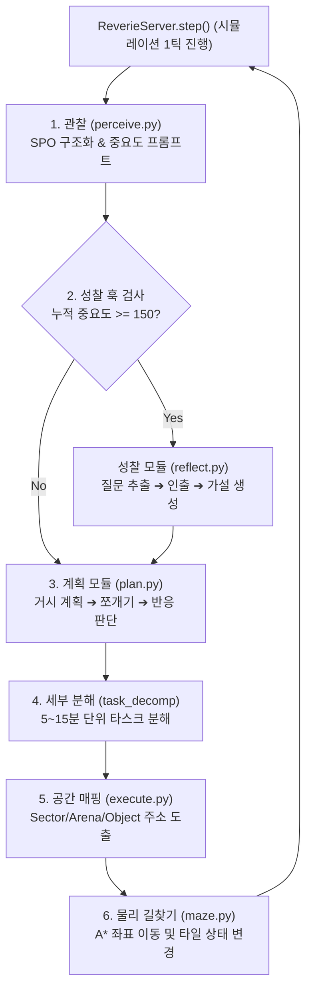

# 스몰빌(Smallville - Generative Agents) 인지 아키텍처 및 프롬프트 파이프라인 심층 보고서

이 보고서는 스탠퍼드 대학교의 **Generative Agents (Smallville)** 프로젝트(Park et al., ACM CHI 2023)의 파이썬 오픈소스 소스코드(`reverie.py`, `persona.py`, `plan.py`, `perceive.py`, `retrieve.py`, `reflect.py`, `run_gpt_prompt.py`)를 코드 레벨에서 완벽하게 분석하여 작성된 정밀 백서입니다.

---

## 1. 스몰빌 전체 인지 시스템 및 메인 루프 (`reverie.py` & `persona.py`)

스몰빌 시뮬레이션은 타일 맵 월드(*The Ville*) 위에서 **[관찰 ➔ 인출 ➔ 계획/분해 ➔ 반응/대화 ➔ 실행 ➔ 성찰]**로 이어지는 6대 인지 모듈이 단일 스레드 파이썬 루프 안에서 순차적(Synchronous Lock-Step)으로 구동됩니다.



---

## 2. 모듈 1: 관찰 및 중요도 평가 (`perceive.py`, `run_gpt_prompt.py`)

### A. 구동 흐름
1.  `perceive.py`는 에이전트의 현재 타일 좌표 $(x, y)$ 기준으로 반경 5타일 시야(Vision Cone) 내의 이벤트를 감지합니다.
2.  감지된 이벤트는 주어-술어-목적어의 SPO 삼원소 `<Subject> <Predicate> <Object>`로 변환됩니다. (예: `(Klaus Mueller, is, writing a paper)`)
3.  새로운 이벤트일 경우 `run_gpt_prompt_poignancy()`를 호출하여 기억의 **중요도(Poignancy Score: 1~10점)**를 매긴 뒤 기억 스트림(`persona.a_mem`)에 저장합니다.

### B. 중요도 평가 프롬프트 템플릿 (`poignancy_event_v1.txt`)
```text
Here is a brief description of {persona_name}:
{persona_iss}

On a scale of 1 to 10, where 1 is purely mundane (e.g., brushing teeth, making bed) and 10 is extremely poignant (e.g., a breakup, college acceptance), rate the poignancy of the following event for {persona_name}.

Event: {event_description}
Rate (number only):
```

*   **입력 컨텍스트**:
    *   `persona_iss`: 에이전트의 정체성, 가치관, 현재 상태 요약문
    *   `event_description`: `"Klaus Mueller sees Isabella Rodriguez decorating the cafe for Valentine's Day"`
*   **출력 파싱 및 예외 처리**:
    *   `int(response.strip())`로 숫자만 추출합니다.
    *   LLM 파싱 실패 시 기본값 `1`점(중요 시스템 이벤트는 `5`점)으로 폴백(Fallback)합니다.

---

## 3. 모듈 2: 연상 기억 스트림 및 인출 엔진 (`retrieve.py`)

### A. 기억 노드(Memory Node) 데이터 구조
모든 기억 노드는 다음과 같은 필드를 가진 파이썬 객체로 저장됩니다:
*   `node_id`: 유일한 정수 ID
*   `type`: `event` (관찰), `thought` (성찰), `chat` (대화)
*   `description`: 자연어 문장 설명
*   `poignancy`: 중요도 점수 (1~10)
*   `embedding`: OpenAI `text-embedding-ada-002`로 생성된 1536차원 벡터

### B. 삼요소 점수 산출 공식 (Tri-Factor Scoring Function)
현재 상황(또는 쿼리 $q$)에 적합한 기억 노드 $m$을 검색하기 위해 세 가지 가중치를 합산합니다.

$$S(m) = \alpha_{\text{rec}} \cdot \overline{\text{Recency}}(m) + \alpha_{\text{imp}} \cdot \overline{\text{Importance}}(m) + \alpha_{\text{rel}} \cdot \overline{\text{Relevance}}(m)$$

*   **최근성 (Recency)**: 경과된 시뮬레이션 시간 $\Delta t$(시간 단위)에 따라 기하급수적 감쇠 적용:
    $$\text{Recency}(m) = 0.995^{\Delta t}$$
*   **중요도 (Importance)**: 생성 시 매겨진 1~10점의 `poignancy` 점수.
*   **의미론적 유사도 (Relevance)**: 쿼리 벡터 $\mathbf{v}_q$와 기억 벡터 $\mathbf{v}_m$ 사이의 코사인 유사도:
    $$\text{Relevance}(m) = \frac{\mathbf{v}_m \cdot \mathbf{v}_q}{\|\mathbf{v}_m\| \|\mathbf{v}_q\|}$$
*   **Min-Max 정규화**: 세 변수는 모두 $[0, 1]$ 범위로 정규화된 후 합산되어 상위 $K$개(보통 10~25개)가 인출됩니다.

---

## 4. 모듈 3: 거시 장기 계획 수립 (`plan.py`)

### 1단계: 기상 시간 결정 (`wake_up_hour_v1.txt`)
*   **프롬프트 입력**: 에이전트 페르소나, 타고난 성격, 라이프스타일 요약, 어제 일과 요약
*   **프롬프트 템플릿**:
    ```text
    Name: {persona_name}
    Innate traits: {innate_traits}
    Lifestyle: {lifestyle}
    {persona_name}'s daily plan for yesterday: {yesterday_plan}

    What time does {persona_name} wake up today?
    Output format: HH:MM AM/PM
    ```
*   **출력**: `6:00 AM`

### 2단계: 하루 거시 일정 생성 (`daily_planning_v6.txt`)
*   **프롬프트 템플릿**:
    ```text
    Name: {persona_name}
    Innate traits: {innate_traits}
    Lifestyle: {lifestyle}
    Yesterday's plan: {yesterday_plan}
    Current Date: {date}

    In 5 to 10 bullet points, write down a broad daily schedule for {persona_name} today starting from {wake_up_hour}.
    Format:
    1) wake up and completion of morning routine at 7:00 AM
    2) ...
    ```
*   **출력 파싱**: 불릿 포인트 리스트를 정규표현식으로 추출해 거시 시간 블록을 조립합니다.

### 3단계: 24시간 블록 할당 (`generate_hourly_schedule_v2.txt`)
*   거시 불릿 일정을 00:00부터 23:00까지의 24개 1시간 배열(`List[str]`)로 정확히 매핑합니다.

---

## 5. 모듈 4: 계획 세분화 (`plan.py`)

1시간 단위의 거시 계획을 물리 이동이 가능한 5분~15분 단위 세부 타스크로 쪼갭니다.

### 프롬프트 템플릿 (`task_decomp_v3.txt`)
```text
Here is {persona_name}'s activity for the next hour ({hour_str}): {hourly_task}.
Decompose this activity into specific sub-tasks with durations (in minutes) that sum up to {total_minutes} minutes.

Format:
- sub-task description (duration in minutes)
```

*   **프롬프트 입력 예시**: `hourly_task = "preparing breakfast and eating"`, `total_minutes = 60`
*   **LLM 출력 예시**:
    ```text
    - making coffee (10 mins)
    - cooking eggs and bacon (20 mins)
    - eating breakfast at the dining table (20 mins)
    - washing dishes (10 mins)
    ```
*   **정규표현식 파싱 코드**:
    ```python
    # 파이썬 파싱 패턴
    pattern = r"^(.*?)\s*\((?:duration in minutes:\s*)?(\d+)\s*mins?\)"
    # 추출 결과: [("making coffee", 10), ("cooking eggs and bacon", 20), ...]
    ```
*   추출된 타스크들은 시작분/종료분 타임스탬프와 함께 에이전트의 세부 행동 큐(Queue)에 등록됩니다.

---

## 6. 모듈 5: 실시간 반응 및 대화 (`plan.py`, `converse.py`)

### 1단계: 반응 여부 결정 (`decide_to_react_v2.txt`)
*   **트리거**: 시야 내에서 다른 에이전트나 돌발 이벤트를 관찰했을 때.
*   **프롬프트 입력**: 현재 세부 행동, 관찰된 사건 SPO, 해당 상대방과 관련된 과거 인출 기억들.
*   **LLM 선택지**: `Option 1: Continue current plan` / `Option 2: React to event`
*   **파싱**: `"Option 2"`가 리턴되면 현재 일정을 중단하고 동적 재계획(Re-planning) 프롬프트를 보냅니다.

### 2단계: 대화 시작 판정 (`decide_to_talk_v2.txt`)
*   상대방에게 다가가 말을 걸 것인지 판단합니다 (`Yes` / `No`).

### 3단계: 실시간 대본 생성 (`agent_chat_v1.txt`)
*   **프롬프트 템플릿**:
    ```text
    [Context regarding Persona A and Persona B]
    {relationship_summary}
    {retrieved_memories}

    Generate a realistic conversation between {persona_a} and {persona_b} about {topic}.
    Format:
    {persona_a}: "..."
    {persona_b}: "..."
    ```
*   **대화 수순 및 후처리**:
    1.  최대 8턴 동안 한 대사씩 LLM을 주고받으며 대본을 생성합니다.
    2.  대화 종료 후 `summarize_conversation_v1.txt`를 통해 대화 내용을 한 줄로 요약합니다.
    3.  `convo_to_thought_v1.txt`를 통해 상대방에 대해 새롭게 알게 된 사실을 성찰 노드로 만듭니다.
    4.  `poignancy_chat_v1.txt`로 중요도를 평가하여 기억 스트림에 주입합니다.

---

## 7. 모듈 6: 주기적 성찰 및 가설 도출 (`reflect.py`)

### A. 성찰 훅 (Reflection Trigger)
에이전트가 새로운 기억을 얻을 때마다 `poignancy` 점수를 누적합니다.

$$\sum_{m \in \text{new\_memories}} \text{poignancy}(m) \ge 150$$

누적 점수가 **150점**을 초과하면 에이전트는 즉시 일시정지하고 성찰 프로세스를 실행합니다.

### B. 성찰 3단계 프롬프트 파이프라인


#### 1. 핵심 질문 생성 (`generate_focal_pt_v1.txt`)
*   **프롬프트**: 최근 100개 기억을 주고 *"이 에이전트의 삶에서 가장 중요한 3가지 핵심 질문을 추출하라"*고 요청합니다.

#### 2. 관련 기억 인출
*   도출된 3가지 질문 각각을 쿼리로 삼아 `retrieve.py`를 실행해 가장 연관성이 높은 과거 기억들을 수집합니다.

#### 3. 고차원 가설 도출 (`insight_and_evidence_v1.txt`)
*   **프롬프트 템플릿**:
    ```text
    Statements about {persona_name}:
    1. Klaus is researching gentrification in Oak Hill.
    2. Klaus expressed frustration about high rent to Isabella.
    3. Klaus read 3 books about urban economics yesterday.

    What 5 high-level insights can you infer from the statements above?
    Output format:
    Insight: <insight text> [Statements: <comma-separated indices>]
    ```
*   **출력 파싱 예시**:
    *   `Insight: Klaus is deeply concerned about local economic inequality. [Statements: 1, 2, 3]`
*   **기억 트리에 저장**: 이 가설은 `thought` 노드로 저장되며, 증거가 된 과거 기억 노드의 ID가 자식 에지(Edge)로 연결되어 계층적 기억 트리를 형성합니다.

---

## 8. 공간 트리 및 물리 좌표 매핑 (`execute.py`, `maze.py`)

### A. 계층적 공간 주소 (Spatial Tree)
스몰빌 공간은 4단계 트리가 텍스트로 구성됩니다:

$$\text{World (The Ville)} \longrightarrow \text{Sector (Student Residence)} \longrightarrow \text{Arena (Bathroom)} \longrightarrow \text{Game Object (shower)}$$

### B. 공간 위치 도출 프롬프트
1.  **구역 선택 (`action_location_sector_v2.txt`)**: 세부 행동 텍스트를 보고 어느 `Sector`로 이동할지 결정.
2.  **오브젝트 및 아레나 선택 (`action_location_object_v1.txt`)**: 해당 구역 내에서 타깃 `Arena`와 `Game Object` 결정.
3.  **이모지 표현 생성 (`generate_pronunciatio_v1.txt`)**: 타일 위에 띄울 이모지 생성 (예: `"cooking breakfast 🍳"`).
4.  **오브젝트 상태 업데이트 (`generate_obj_event_v1.txt`)**: 대상 오브젝트의 전역 상태 덮어쓰기 (예: `(stove, is, cooking)`).

### C. 타일 길찾기 연동 (`maze.py`)
*   도출된 `Game Object`가 위치한 2D 맵 상의 $(x, y)$ 좌표 중 다른 에이전트가 점유하지 않은 타일을 선점합니다.
*   A* 길찾기 알고리즘을 구동하여 1틱(10초)마다 캐릭터를 한 칸씩 이동시킵니다.

---

## 9. 단일 스레드 락스텝 엔진의 6가지 치명적 결함

스몰빌은 학술 연구로서 훌륭한 개념 증명(PoC)이었으나, 상용 게임 엔진 관점에서는 다음과 같은 치명적 구조 한계를 가지고 있습니다.

1.  **동기식 락스텝 블로킹 (Synchronous Lock-Step Blocking)**:
    *   파이썬의 `reverie.py` 메인 루프가 단일 스레드로 돌아가므로, 에이전트 한 명이 LLM API 응답을 기다리는 2~5초 동안 **전체 게임 월드의 시계와 모든 NPC의 연산이 멈춰서 대기**해야 합니다.
2.  **환각의 영구 고착화 (Hallucination Loop)**:
    *   LLM이 단 한 번이라도 사실과 다른 거짓(환각)을 뱉어내면 그것이 관찰 노드로 기록되고, 성찰 모듈을 통해 고차원 신념으로 고착되어 에이전트가 영구적인 망상 상태에 빠집니다.
3.  **성긴 시간 해상도로 인한 마네킹 버그 (Mannequin Bug)**:
    *   행동 분해가 최소 5분~15분 단위로 이루어지므로, 작업을 일찍 마쳐도 다음 타임 블록이 올 때까지 에이전트가 `<waiting>` 상태로 타일 위에 멀뚱히 서 있는 부자연스러운 현상이 반복됩니다.
4.  **하드코딩 예외 처리의 오남용**:
    *   LLM의 무한 호출을 막기 위해 밤 11시 이후 대화 금지, 대화 후 800틱(Tick) 대화 방지 쿨타임 버퍼(`chatting_with_buffer`) 등 수많은 예외 규칙을 하드코딩으로 막아두었습니다.
5.  **극도로 추상화된 액션 레이어**:
    *   "요리하기"는 가스레인지 타일 앞으로 걸어가 텍스트 상태를 바꾸는 것에 불과하며, 칼을 들거나 재료를 써는 등의 구체적 운동 제어(Motor Control) 레이어가 결여되어 있습니다.
6.  **무제한 토큰 폭증 및 비용 한계 ($O(N)$ Growth)**:
    *   기억 도태(Eviction) 시스템이 없어 날수가 지날수록 DB 탐색 대상이 무제한으로 증가합니다. 이에 따라 프롬프트 컨텍스트와 코사인 유사도 연산량이 비대해져 게임 시간 3일 시뮬레이션에 수백만 원의 API 비용이 소모됩니다.
